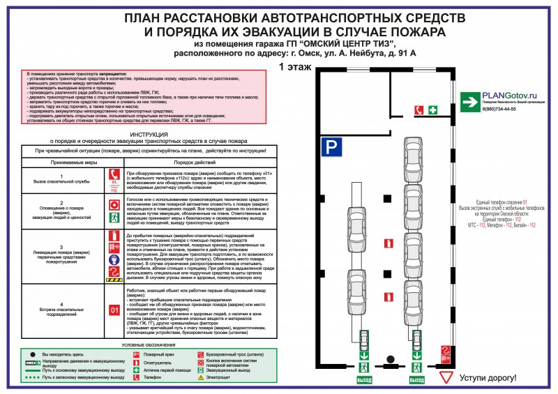

# Инструкция по пользованию парковкой

**Внимание! Соблюдение правил парковки обязательно для всех резидентов и гостей. Неправильно припаркованный автомобиль может быть эвакуирован за счет владельца.**

## Регистрация автомобиля

Для получения доступа на охраняемую парковку резидент должен:

1.  **Заполнить электронную заявку** в личном кабинете на сайте УК или через мобильное приложение.
2.  **Предоставить скан-копии документов:**
    *   Свидетельство о регистрации транспортного средства (СТС).
    *   Водительское удостоверение собственника автомобиля.
3.  **Оплатить первый месяц** по выбранному тарифу.
4.  **Активировать электронный пропуск** в мобильном приложении после одобрения заявки (в течение 24 часов).

## Тарифы на парковку (действуют с 01.01.2024)

| Тип места | Стоимость в месяц | Примечание |
|-----------|-------------------|------------|
| **Гость** | 500 руб./час | Максимальное время парковки - 12 часов |
| **Резидент (открытая зона)** | 2 000 руб. | Доступ по электронному пропуску |
| **Резидент (крытое, подземное)** | 5 000 руб. | Зона "Премиум", ограниченное количество мест |
| **Электромобиль** | 3 500 руб. | Включает использование зарядной станции |

## Схема проезда и зонирование

Ознакомьтесь со схемой подземной парковки и проезда к ней. Пожалуйста, соблюдайте разметку и не занимайте места, отмеченные для гостей и инвалидов.

*Рис. 1 - Схема подземной парковки и подъездных путей*

## Важные правила

*   **Запрещено** занимать более одного парковочного места.
*   **Запрещено** парковаться в проездах и перед шлагбаумами.
*   **Запрещено** мыть автомобили и проводить ремонтные работы на территории парковки.
*   **Рекомендуется** оставлять ключи от автомобиля с консьержем на случай необходимости перемещения ТС.

Более подробная информация и форма заявки доступны на [официальной странице услуги на нашем сайте](https://zk-severnoe-siyanie.ru/parking).

---

**Техническая поддержка парковки: +7 (495) 123-45-67 (доб. 3)**

---

---

[← Вернуться к инструкциям](/instructions/) | [← Вернуться на главную](/#/)
